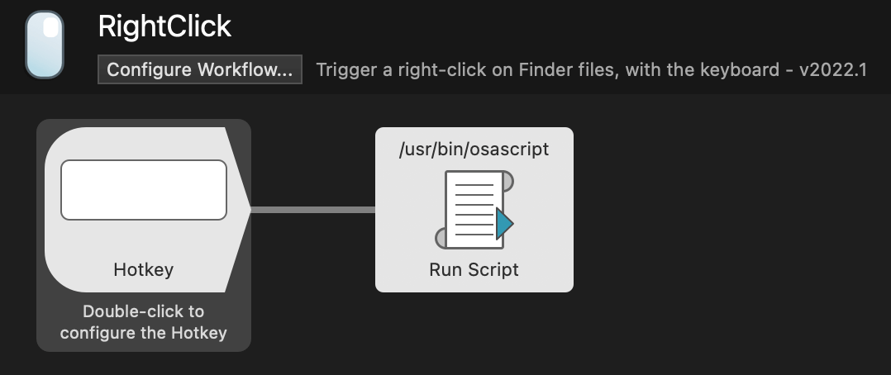

#  Right Click Alfred Workflow

Trigger a right-click on Finder files, with the keyboard

[⤓ Install on the Alfred Gallery](https://alfred.app/workflows/vitor/right-click)

## Usage

Configure the [Hotkey](https://www.alfredapp.com/help/workflows/triggers/hotkey/) to trigger a right-click in Finder selections via the keyboard.

